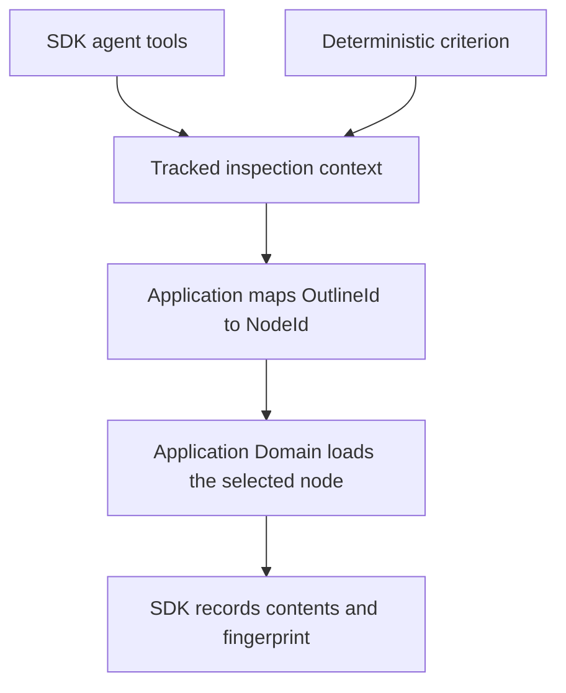

# Sources and inspection

Source inspection helps a criterion find files, select items from their
outlines, and read the items it needs. TBV supplies filesystem inspection
through `Sources` and its agent tools. The application selects the project
directory and maps selected source items to graph nodes.

## Identify source files

:::{definition} resource
:phrase: source resource

A *source resource* is a file in the project directory. Its project-relative
path identifies the file; an outline selector identifies an item within it.
:::

:::{req} source_addresses
The source tools identify project files with project-relative `PathBuf` values.

```rust,ignore
let file = std::path::PathBuf::from("src/auth.rs");
```

An item within that file uses the path and selector in `OutlineId` under
{cite}`requirements.sdk.outlines.address_identity`.
:::

## Select the project directory

:::{req} provider
[`Sources`](../../rustdocs/trust_but_verify/sources/struct.Sources.html) supplies
built-in filesystem listing, reading, outlining, text search, and structural
search. Construct it with the project directory:

```rust,ignore
use trust_but_verify::sources::Sources;

let sources = Sources::new(repository_root);
```
:::

:::{req} provider.attachment
A validator for a source-capable domain uses the supplied project directory
for its fixed source inspection tools. Attach `Sources` once when constructing
the validator; the domain supplies the mapping under
{cite}`requirements.sdk.sources.source_nodes`.

```rust,ignore
use trust_but_verify::domain::SourceNodes;
use trust_but_verify::sources::Sources;
use trust_but_verify::graph::validator::Validator;

impl<D: SourceNodes + 'static> Validator<D>
where
    D::EdgeLabel: serde::de::DeserializeOwned + schemars::JsonSchema + PartialEq,
    D::Error: std::fmt::Display,
{
    // ...

    pub fn with_sources(self, sources: Sources) -> Self;

    // ...
}
```
:::

:::{req} local_provider
Source inspection uses the project directory and respects `.gitignore`,
including nested ignore files and their exceptions. Untracked files are
available unless ignored. The same scope applies to listing, reading,
outlining, text search, and structural search, including requests naming a
file or subdirectory directly.

Files outside the project directory and Git metadata are excluded. A direct
read of an excluded file returns an error.
:::

:::{req} provider.errors
Listing and reading failures return errors, distinct from successful empty
listings and successful reads of empty files.
:::

## Outline and search the available files

:::{req} provider_defaults
TBV selects a compiled-in outline language from the file extension and uses
the plain-text outline for other files. Text search uses regular expressions.
Structural search uses the requested language's syntax capability under
{cite}`requirements.sdk.outlines.language_provider.structural_search`.
:::

:::{req} provider_defaults.composition
Outlining reads one file snapshot and parses its supplied bytes. Text search
lists files in scope and searches their bytes. Structural search lists files
in scope and parses their supplied snapshots. These operations share the
filesystem scope under {cite}`requirements.sdk.sources.local_provider`.
:::

:::{req} provider_results
Inspection preserves the requested path scope and the selected language for
outlining and structural search.
:::

:::{req} provider_results.parse_snapshot
A parse result retains the file identity, bytes, and outline prepared from
those bytes together. Selecting an item from that result uses the retained
snapshot under {cite}`requirements.sdk.outlines.snapshot`.
:::

:::{req} provider_results.search_completeness
Search results distinguish complete results from truncated or incomplete
ones. An operation failure returns an error, rather than a complete empty
result.
:::

## Connect source items to graph nodes

The application maps discovered source items to its graph. For HC,
`src/auth.rs` with selector `fn[check_token]` identifies a source node.

:::{req} source_nodes
An application supporting tracked source inspection maps `OutlineId` to its
graph's `NodeId`. The mapped node represents the requested path and selector;
an unsupported or invalid address returns an error. The SDK reads the mapped
node through the application's `Domain` interface.

```rust,ignore
use trust_but_verify::domain::Domain;
use trust_but_verify::outline::OutlineId;

pub trait SourceNodes: Domain {
    fn source_node(&self, item: &OutlineId) -> Result<Self::NodeId, Self::Error>;
}
```
:::

For a source node, HC's `Domain::node_content` resolves its `OutlineId` and
returns an `OutlineContent`. The returned value supplies its fingerprint and
agent text through `NodeContents` under
{cite}`requirements.sdk.outlines.node_contents`.

:::{req} provider_observations
The tracked source-read operation resolves the selected `OutlineId` through
the application's source-node mapping and reads that node through `Domain`.
Successful reads delivered to the caller record that node's identity and the
fingerprint of its supplied contents.

The graph's recording and freshness contracts apply under
{cite}`requirements.sdk.graph.evidence.node_inputs` and
{cite}`requirements.sdk.graph.evidence.checking_records`.
:::

## Inspection runs through the tracked context

:::{req} redaction
TBV automatically redacts recognized credentials in source excerpts delivered
by its inspection tools and in node text supplied to its agent requests.
The built-in rules replace recognized secret regions with redaction markers
while preserving line breaks. SDK-supplied outline languages use the same redacted
regions, so changing only a recognized credential does not change its
structural fingerprint.

Loaded source snapshots retain the original text for selection and spans;
redaction applies when preparing model-visible text and structural hashes.
Filesystem evidence storage preserves the supplied record. Applications supply
their own answer values and remain responsible for what those answers contain.
Habeas additionally recognizes explicit credentials in its configuration files
under {cite}`requirements.authoring.credentials`.
:::

Deterministic criterion code and SDK agent tools use the same inspection
operations. A direct tracked read records its returned input. An agent read
records the prepared input when it is delivered, including continuation
pages.


```mermaid
flowchart TD
    Agent["SDK agent tools"] --> Context["Tracked inspection context"]
    Code["Deterministic criterion"] --> Context
    Context --> Mapping["Application maps OutlineId to NodeId"]
    Mapping --> Domain["Application Domain loads the selected node"]
    Domain --> Trace["SDK records contents and fingerprint"]
```

Listing, outlining, and searching help choose nodes to read. A subsequent
tracked read records the selected node.
[Context tools](graph/context-tools.md) describes each operation's results
and recording semantics.

[Source outlines](outlines.md) introduces `OutlineId`, `OutlineContent`, and
`OutlineLang`. Its [language chapters](outlines.md#language-specific-rules)
define the item kinds, selectors, and fingerprints for each language.
